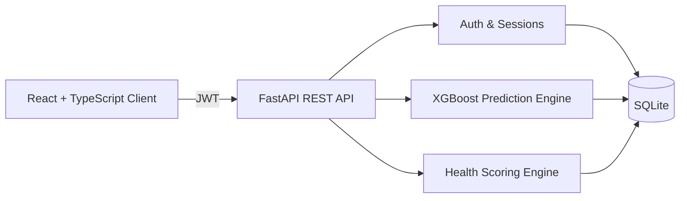

# Hamid Alam

**Computer Science Engineering Student · Full-Stack Developer · AI/ML Engineer**

Building applications where machine learning, reliable backends, and clean interfaces work together.

---

## About Me

I am a Computer Science Engineering student focused on full-stack development and applied machine learning. My work spans data structures and systems programming in C and C++, machine learning pipelines, REST APIs, local LLM workflows, and consumer-facing web and mobile applications.

- Currently building **AlamX**, an AI-driven wellness and health intelligence platform
- Exploring local LLM inference with Ollama and domain-specific models such as BioMistral
- Interested in health-tech, applied ML, and backend system design

---

## Tech Stack

  

| Area | Technologies |
| --- | --- |
| **Languages** | Python, Java, C, C++, TypeScript, JavaScript, Dart |
| **Frontend** | React, Vite, Tailwind CSS v4, Recharts, Flutter |
| **Backend** | FastAPI, REST APIs, SQLite, JWT authentication |
| **Machine Learning** | XGBoost, scikit-learn, pandas, SMOTE |
| **Local LLMs** | Ollama, BioMistral |
| **Tools** | Docker, Git, GitHub, MATLAB Simulink, Anaconda |
| **Environments** | macOS, Windows, MinGW |

---

## Featured Project — AlamX

**AI-driven wellness and health intelligence platform** combining predictive machine learning, wellness tracking, personalized health scoring, and interactive data visualization.

### Key Features

- **Health Scoring Engine** — An 80/20 model that separates a clinical baseline (heart rate, blood pressure, BMI, sleep, active symptom penalties) from daily engagement (steps, hydration, nutrition, mindfulness). Includes a macro-balance modifier, projected end-of-day score, rolling 5-day consistency multiplier, and monotonic, non-decreasing scoring behavior.
- **Symptom-Based Prediction** — An XGBoost classifier over a 132-feature symptom vector covering 41 conditions. Returns confidence scores via `predict_proba` along with ranked alternative predictions, mapped to readable condition descriptions. Achieved 99.64% accuracy on the project's evaluation dataset.
- **Single Source of Truth** — User-configurable targets (steps, water, sleep, nutrition) are stored in SQLite, served through FastAPI, and propagated to the dashboard, wellness plan, and scoring engine through a shared React Context layer rather than hard-coded in UI components.
- **Authentication & Security** — Stateless JWT authentication using `python-jose`, `passlib`, and `bcrypt`. A database-backed `token_version` enables "log out of all devices", and every API route enforces per-user data isolation alongside client-side route protection.
- **Data Model** — `User_Profile` stores persistent user baselines, kept separate from `Daily_Health_Log`, which stores longitudinal health records.
- **Frontend** — React, TypeScript, Vite, Tailwind CSS v4, and Recharts, with custom SVG interface elements to minimize third-party icon and font dependencies.

**ML pipeline:** data cleaning → preprocessing → feature engineering → class balancing (SMOTE) → training → evaluation → inference

---

## Projects

| Project | Description |
| --- | --- |
| [**AlamX**](https://github.com/YOUR_USERNAME/AlamX) | AI-driven wellness and health intelligence platform |
| [**CarePath**](https://github.com/YOUR_USERNAME/CarePath) | Evidence-linked healthcare recovery architecture |
| [**NirogX**](https://github.com/YOUR_USERNAME/NirogX) | AI-powered symptom analysis |
| [**SAJAG**](https://github.com/YOUR_USERNAME/SAJAG) | Privacy-oriented intelligent health architecture |

---

## Engineering Approach

- **Understand, design, build, test** — in that order
- Prefer simple systems over unnecessary complexity
- Let data inform product decisions
- Use AI where it solves a real problem

---

## GitHub Stats

---

**Open to internships, collaborations, and conversations about AI, health-tech, and full-stack development.**

📫 [hamidalam763@gmail.com](mailto:hamidalam763@gmail.com)

